# fp-sisop-IT10-2021
## Anggota Kelompok
- Naufal Aprilian Marsa Mahendra    05311940000007
- Dian Arofati Nur Zamzamy          05311940000011
- Christopher Benedict              05311840000024
## Autentikasi
### Soal
Ada username dan password tertentu untuk bisa akses database yang dia punya hak. Jika root (sudo) bisa akses semua database (tidak perlu didefinisikan secara rinci haknya, hanya dia bisa akses atau nggak).
```
# Format

./[program_client_database] -u [username] -p [password]

# Contoh

./client_databaseku -u jack -p jack123

```
User root sudah ada dari awal.
```
# Contoh cara user root mengakses program client

sudo ./client_database

```
### Penyelesaian
Disini pada sisi client akan menerima rgumen yang akan dijadinkannya menjadi username dan password yang akan dikirimkan ke server untuk melakukan login. Dengan diawalo -u untuk username dan -p untuk password.
```
    if (argc != 5)
    {
        printf("<USAGE>\n./[program_client_database] -u [username] -p [password]\n");
        return 1;
    }
    if ((strcmp(argv[1], "-u") != 0 || strcmp(argv[3], "-p") != 0))
    {
        printf("asu");
        printf("<USAGE>\n./[program_client_database] -u [username] -p [password]\n");
        return 1;
    }

```
### Soal
Username, password, dan hak akses db disimpan di suatu database juga, tapi tidak ada user yang bisa akses database tersebut kecuali mengakses menggunakan root.

User root sudah ada dari awal.
### Penyelesaian
User root sudah ada dari awal didefinisikan pada fungsi initDatabase(). Untuk melakukan pengecekan apakah sebuah program dijalankan menggunakan root atau tidak adalah dengan menggunakan getuid(). Jika getuid() == maka root yang menjalankannya.
```
void initDatabase(){
    mkdir("databases",777);
    mkdir("databases/init",777);
    FILE *fptr;
    fptr = fopen("databases/init/users.table", "r+");
    fprintf(fptr,"username|string\tpassword|string\nroot\troot\n");
    fclose(fptr);

    FILE *fptr2;
    fptr2 = fopen("databases/init/permission.table", "r+");
    fprintf(fptr2,"username|string\tdatabase|string\n");
    fclose(fptr2);
}
```
### Soal
Menambahkan user (Hanya bisa dilakukan user root)
```
# Format

CREATE USER [nama_user] IDENTIFIED BY [password_user];

# Contoh

CREATE USER jack IDENTIFIED BY jack123;

```
### Penyelesaian
Hal pertama yang dilakukan adalah mengecek terlebih dahulu Command dari client apakah sudah benar atau belum pada fungsi checkCommandAddUSer(). disini akan melakukan strtok dengan delimiter " " sehingga akan didapatkan [nama_user] dan [password].
```
int checkCommandAddUser(char *command, char *username, char *password)
{
    // CREATE USER [nama_user] IDENTIFIED BY [password_user];
    char *token = strtok(command, " ");
    if (token == NULL)
    {
        strcpy(message, "Invalid Syntax\n");
        return 0;
    }
    token = strtok(NULL, " ");
    // [nama_user]
    if (token == NULL)
    {
        strcpy(message, "Invalid Syntax\n");
        return 0;
    }
    token = strtok(NULL, " ");
    if (token == NULL)
    {
        strcpy(message, "Invalid Syntax\n");
        return 0;
    }

    strcpy(username, token);
    token = strtok(NULL, " ");
    if (token == NULL)
    {
        strcpy(message, "Invalid Syntax\n");
        return 0;
    }
    if (strcmp(token, "IDENTIFIED") != 0)
    {
        strcpy(message, "Invalid Syntax\n");
        return 0;
    }
    token = strtok(NULL, " ");
    if (token == NULL)
    {
        strcpy(message, "Invalid Syntax\n");
        return 0;
    }
    if (strcmp(token, "BY") != 0)
    {
        strcpy(message, "Invalid Syntax\n");
        return 0;
    }
    // [password_user]
    token = strtok(NULL, " ");
    if (token == NULL)
    {
        strcpy(message, "Invalid Syntax\n");
        return 0;
    }
    if (strcmp(&token[strlen(token) - 1], ";") == 0)
    {
        strncpy(password, token, strlen(token) - 1);
    }
    else
    {
        strcpy(message, "Invalid Syntax\n");
        return 0;
    }
    // DEBBUG
    // ////printf("%s\t%s", username, password);
    return 1;
}
```
Setelah command selesai maka akan dilanjutkan ke fungsi addUser() dimana fungsi tersebut akan melakukan cek terlebih dahulu apakah user root atau bisa. Kita bisa mengeceknya menggunakan getuid() == 0 jika dia merupakan user root. Setelah terverifikasi maka akan ditambahkan user baru ke dalam database init pada table users.table. Dengan membuka filenya dengan fopen dan mode a+ untuk melakukan append
```
void addUser(char *namaUser, char *passwordUser)
{
    if (getuid() == 0)
    {
        int check = checkDataExist(namaUser, "databases/init/users.table", 0);
        if (!check)
        {
            FILE *fptr;
            fptr = fopen("databases/init/users.table", "a+");

            if (fptr == NULL)
            {
                strcpy(message, "Error\n");

                return;
            }

            fprintf(fptr, "%s\t%s\n", namaUser, passwordUser);
            fclose(fptr);
        }
        else
        {
            strcpy(message, "User Already Used\n");
        }
    }
    else
    {
        strcpy(message, "You Are Not root\n");
    }
    strcpy(message, "Success\n");
    memset(data_exist, 0, sizeof(data_exist));
}
```
## Data Definition Language
### Soal
Input penamaan database, tabel, dan kolom hanya angka dan huruf.
Semua user bisa membuat database, otomatis user tersebut memiliki permission untuk database tersebut.
```
# Format


CREATE DATABASE [nama_database];


# Contoh

CREATE DATABASE database1;


```
### Penyelesaian
Disini settiap user dapat menambahkan database. Hal pertama yang dilakukan adalah mengecek terlebih dahulu apakah sudah benar untuk command yang diinputkan oleh user. Sekaligus menangkap [nama_database] yang ada pada inputan user dengan melakukan strtok() dengan delimiter " ". 
```
int checkCommandCreateDatabase(char *command, char *database)
{
    // CREATE DATABASE [nama_database];
    if (strcmp(&command[strlen(command) - 1], ";") != 0)
    {
        strcpy(message, "Invalid Syntax\n");

        return 0;
    }
    char *token = strtok(command, " ");
    token = strtok(NULL, " ");
    token = strtok(NULL, " ");
    // [nama_user]
    if (token == NULL)
    {
        strcpy(message, "Invalid Syntax\n");

        return 0;
    }
    strncpy(database, token, strlen(token) - 1);
    // ////printf("DEBUG ->%s ini database\n", database);
    return 1;
}
```
Setelah command yang sesuai. Maka selanjutnya memanggil fungsi createDatabase(). Fungsi ini pertama akan melakukan cek terlebih dahulu apakah nama database sudah ada atau belum dengan menggunakan mkdir(). Jika tenyata belum ada maka akan menambahkan permission database dengan memasukkan user yang menginputkan dan root ke table permission.table.
```
void createDatabase(char *database)
{
    char fullpath[200] = {0};
    sprintf(fullpath, "databases/%s", database);
    int check = mkdir(fullpath, 0777);

    // check if directory is created or not
    if (!check)
    {
        FILE *fptr;
        fptr = fopen("databases/init/permission.table", "a+");

        if (fptr == NULL)
        {
            strcpy(message, "Error\n");
            return;
        }
        if (strcmp(SESSION_USERNAME, "root") == 0)
        {
            fprintf(fptr, "%s\t%s\n", SESSION_USERNAME, database);
            fclose(fptr);
        }
        else
        {
            fprintf(fptr, "%s\t%s\nroot\t%s\n", SESSION_USERNAME, database, database);
            fclose(fptr);
        }
        strcpy(message, "Success\n");
    }
    else
    {
        strcpy(message, "Unable to create directory\n");
        return;
    }
}
```
### Soal
Root dan user yang memiliki permission untuk suatu database untuk bisa membuat tabel untuk database tersebut, tentunya setelah mengakses database tersebut. Tipe data dari semua kolom adalah string atau integer. Jumlah kolom bebas.
```
# Format

CREATE TABLE [nama_tabel] ([nama_kolom] [tipe_data], ...);

# Contoh

CREATE TABLE table1 (kolom1 string, kolom2 int, kolom3 string, kolom4 int);

```
### Penyelesaian
Hal pertama yang dilakukan adalah melakukan cek terlebih dahulu apakah seorang user sudah melakukan USE pada database yang ingin dia pakai. Dengan mengecek variabel SESSION_DATABASE apakah kosong atau tidak.
Selanjutnya yang dilakukan adalah melakukan check command user yang telah diinputkan apakah syntax nya sudah sesuai atau belum dengan melakukan strtok satu satu dengan delimiter " " dan menyocokkannya dengan command yang sesuai. Sekaligus mendapatkan nama table beserta kolom kolomnya. 
```
int checkCommandCreateTable(char *input, char *table, char *column_name)
{
    char hasil[1024] = {0};

    // Returns first token
    if (strcmp(&input[strlen(input) - 1], ";") != 0)
    {
        strcpy(message, "Invalid Syntax\n");

        return 0;
    }
    char *token = strtok(input, " ");
    ////printf("1 %s\n", token);
    token = strtok(NULL, " ");
    ////printf("2 %s\n", token);
    if (token == NULL)
    {
        strcpy(message, "Invalid Syntax\n");

        return 0;
    }
    token = strtok(NULL, " ");
    strcpy(table, token);
    ////printf("3 %s\n", token);
    if (token == NULL)
    {
        strcpy(message, "Invalid Syntax\n");

        return 0;
    }
    token = strtok(NULL, "(");
    ////printf("4 %s\n", token);
    if (token == NULL)
    {
        strcpy(message, "Invalid Syntax\n");

        return 0;
    }
    else if (strcmp(token, ");") == 0)
    {
        strcpy(message, "Your Column Is Empty\n");
        return 0;
    }
    else
    {
        strcpy(column, " ");
        strncat(column, token, strlen(token) - 2);
        ////printf("%s\n", column);
        int j = 0;
        char *token2 = strtok(column, " ");
        j++;
        if (token == NULL)
        {
            strcpy(message, "Invalid Syntax\n");

            return 0;
        }
        ////printf("%s\n", token2);
        strcat(column_name, token2);
        strcat(column_name, "|");
        token2 = strtok(NULL, " ");
        j++;
        if (token == NULL)
        {
            strcpy(message, "Invalid Syntax\n");

            return 0;
        }
        while (token2 != NULL)
        {

            if (strstr(token2, ","))
            {
                strncat(column_name, token2, strlen(token2) - 1);
                strcat(column_name, "\t");
            }
            else
            {
                strcat(column_name, token2);
                strcat(column_name, "|");
            }

            ////printf("%s\n", token2);
            token2 = strtok(NULL, " ");
            j++;
        }
        if (j % 2 == 0)
        {
            strcpy(message, "Invalid Syntax\n");

            return 0;
        }

        column_name[strlen(column_name) - 1] = 0;
        // ////printf("\n%s-----%d", column_name, j);
    }

    // kolom1|string\tkolom2|int\tkolom3|string\tkolom4|int
    return 1;
}
```
Selanjutnya Tinggal kta lakukan createTable()dengan mengirimkan kolom yang sudah kita dapatkan dengan melakukan fopen() mode a+ untuk menuliskan kolom pada tabel yang telah dibuat

```
void createTable(char *table, char *column_name)
{
    FILE *fptr;
    char fullpath[500] = {0};
    sprintf(fullpath, "databases/%s/%s", SESSION_DATABASE, table);
    // ////printf("%s-----------", fullpath);
    fptr = fopen(fullpath, "a+");
    if (fptr == NULL)
    {
        strcpy(message, "Error\n");

        return;
    }
    fprintf(fptr, "%s\n", column_name);
    fclose(fptr);
    strcpy(message, "Success\n");
}
```

### Soal
Bisa melakukan DROP database, table (setelah mengakses database), dan kolom. Jika sasaran drop ada maka didrop, jika tidak ada maka biarkan.
```
# Format

DROP [DATABASE | TABLE | COLUMN] [nama_database | nama_tabel | [nama_kolom] FROM [nama_tabel]];

# Contoh

## Drop database

DROP DATABASE database1;

## Drop table

DROP TABLE table1;

## Drop Column

DROP COLUMN kolom1 FROM table1;
```
### Penyelesaian
Drop Database

Pada Drop Database kali ini pertama kita akan menangkap terlebih dahulu nama database yang akan di Drop dengan melakukan strtok() dengan delimiter " ". Setelah itu melakukan cek Apakah user tersebut memeliki permission database tersebut apa tidak dengan memanggil fungsi checkDataExist(). fungsi ini akan mencocokkan tiap data yang ada engan nama databse yang dinput oleh user pada table permission.table.
```
int checkCommandDropDatabase(char *command, char *database)
{
    // DROP DATABASE database1;

    if (strcmp(&command[strlen(command) - 1], ";") != 0)
    {
        strcpy(message, "Invalid Syntax\n");

        return 0;
    }
    char *token = strtok(command, " ");
    token = strtok(NULL, " ");
    if (token == NULL)
    {
        strcpy(message, "Invalid Syntax\n");

        return 0;
    }
    token = strtok(NULL, " ");
    // [nama_database]
    if (token == NULL)
    {
        strcpy(message, "Invalid Syntax\n");

        return 0;
    }
    strncpy(database, token, strlen(token) - 1);
    return 1;
}
```

Jika memiliki maka tinggal memanggil fungsi dropDatabase(). dengan melakukan system(rm -r [database]). Dan tidak lupa untuk menghapus permissionnya juga pada tabel permission.table dengan memanggil fungsi writeTble()
```
void dropDatabase(char *data, char *database)
{
    char fullpathCommand[1024] = {0};
    sprintf(fullpathCommand, "rm -r databases/%s", database);
    system(fullpathCommand);
    readDatabase("init", "permission.table");
    writeTable("databases/init/permission.table");
    strcpy(message, "Success\n");
}
```

Drop Table

Hal Pertama yang dilakukan adalah melihat apakah user sudah melakukan USE DATABASE atau belum. Dengan melakukan check terhadap variabel SESSION_DATABSE. Selanjutnya melakukan pegecekan terhadap command dari user menggunakan checkCommandDropTable(). Melakukan strtok sampai menemukan nama table yang diinputkan oleh user dan menyimpannya
```
int checkCommandDropColumn(char *command, char *column, char *table)
{
    // DROP COLUMN kolom1 FROM table1;
    if (strcmp(&command[strlen(command) - 1], ";") != 0)
    {
        strcpy(message, "Invalid Syntax\n");

        return 0;
    }
    // DROP
    char *token = strtok(command, " ");
    // COLUMN
    token = strtok(NULL, " ");
    if (token == NULL)
    {
        strcpy(message, "Invalid Syntax\n");

        return 0;
    }
    // kolom1
    token = strtok(NULL, " ");
    if (token == NULL)
    {
        strcpy(message, "Invalid Syntax\n");

        return 0;
    }
    strncpy(column, token, strlen(token));
    // FROM
    token = strtok(NULL, " ");
    if (token == NULL)
    {
        strcpy(message, "Invalid Syntax\n");

        return 0;
    }
    // table
    token = strtok(NULL, " ");
    if (token == NULL)
    {
        strcpy(message, "Invalid Syntax\n");

        return 0;
    }
    strncpy(table, token, strlen(token) - 1);
    return 1;
}
```
Setelah itu tinggal memanggil fungsi dropTable(). Fungsi ini akan memanggil remove ke path file table itu berapada. Dengan melakukan sprintf untuk memasukkan path file tersebut ke variabel fullpath lalu dilakukan penghapusan.
```
void dropTable(char *table)
{
    char fullpath[500] = {0};
    sprintf(fullpath, "databases/%s/%s", SESSION_DATABASE, table);
    // ////printf("%s\n",fullpath);
    if (remove(fullpath) == 0)
        strcpy(message, "Success\n");

    else
        strcpy(message, "Error\n");
}
```

Drop Column
Perama akan melakukan check command yang diiunputkan oleh user dengan pemanggilan fungsi checkCommandDropColumn(). Setelah melakukan check menggunakan strtok dan membandingkan tiap kata dengan yang seharusnya. Selanjutnya check juga apakah User sudah melakukan USE database dengan mengecek variabel SESSION_DATABASE.
```
int checkCommandDropColumn(char *command, char *column, char *table)
{
    // DROP COLUMN kolom1 FROM table1;
    if (strcmp(&command[strlen(command) - 1], ";") != 0)
    {
        strcpy(message, "Invalid Syntax\n");

        return 0;
    }
    // DROP
    char *token = strtok(command, " ");
    // COLUMN
    token = strtok(NULL, " ");
    if (token == NULL)
    {
        strcpy(message, "Invalid Syntax\n");

        return 0;
    }
    // kolom1
    token = strtok(NULL, " ");
    if (token == NULL)
    {
        strcpy(message, "Invalid Syntax\n");

        return 0;
    }
    strncpy(column, token, strlen(token));
    // FROM
    token = strtok(NULL, " ");
    if (token == NULL)
    {
        strcpy(message, "Invalid Syntax\n");

        return 0;
    }
    // table
    token = strtok(NULL, " ");
    if (token == NULL)
    {
        strcpy(message, "Invalid Syntax\n");

        return 0;
    }
    strncpy(table, token, strlen(token) - 1);
    return 1;
}
```
Selanjutnya adalah memanggil fungsi yang bernama checkPosition(). Tujuannya adalah untuk melakukan check terhadap posisi kolom yang ingin dilakukan drop.Fungsi ini akan mengembalikan int. Melakukannya dengan strtok dengan delimiter \t dan dilakukan while sampai ketemu NULL.
```
int positionCloumn(char *column_name)
{
    char temp[100] = {0};
    strcpy(temp, column);
    int i = 0;
    char *token = strtok(temp, "\t");
    while (token != NULL)
    {
        if (strstr(token, column_name))
        {
            break;
        }
        token = strtok(NULL, "\t");
        i++;
    }
    return i;
}
```
Setelah mengerti posisinya maka tinggal memanggil fungsi dropColumn(). Fungsi ini akan melakukan pembacaan terhadap database. Setelah itu melakukan pemasukan ke sebuah array dengan melakukan skip setiap bbertemunya posisi kolom. Sehingga tinggal dilakukan penulisan ulang dengan array yang sudah tidak memiliki Column tersebut.
```
void dropColumn(int position)
{
    char temp[200][1024] = {0};
    char hasil[200][1024] = {0};
    for (int i = 0; i < count_row; i++)
    {
        strcpy(temp[i], data_in_table[i]);
        // ////printf("TEMP = > %s\n", temp[i]);
    }

    for (int i = 0; i < count_row; i++)
    {

        char *token = strtok(temp[i], "\t");
        int count = 0;
        while (count < count_column)
        {
            // ////printf("count %d ; position %d\n", count, position);
            if (count == position)
            {
                // ////printf("token -> %s\n", token);
                token = strtok(NULL, "\t");
                count++;
                continue;
            }
            else
            {
                // sidoarjo\n\t
                strcat(hasil[i], token);
                if (!strstr(hasil[i], "\n"))
                {
                    strcat(hasil[i], "\t");
                }
                // ////printf("token -> %s\n", token);
                token = strtok(NULL, "\t");
                count++;
            }
        }

        if (!strstr(hasil[i], "\n"))
        {
            ////printf("masuk");
            strncpy(hasil[i], hasil[i], strlen(hasil[i]) - 1);
            strcat(hasil[i], "\n");
        }
        ////printf("Hasil -> %s ---- %d", hasil[i], i);
    }
    for (int i = 0; i < count_row; i++)
    {
        strcpy(data_in_table[i], hasil[i]);
    }
    for (int i = 0; i < 100; i++)
    {
        data_exist[i] = -2;
    }
}
```
## Data Manipulation Language
### Soal
### Insert
Hanya bisa insert satu row per satu command. Insert sesuai dengan jumlah dan urutan kolom.
```
# Format

INSERT INTO [nama_tabel] ([value], ...);

# Contoh

INSERT INTO table1 (‘value1’, 2, ‘value3’, 4);


```
### Penyelesaian
Pertama kali yang dilakukan adalah melakukan check terhadap command yang diberikan oleh user apakah sudah sesuai format atau belum dengan melakukan pemanggilan fungsi checkCommandInsert(). Dalam pengecekan menggunakan strtok dengan delimiter " " untuk melakukan pengecekan setiap kata apakah sudah sama dengan seharusnya atau belum. Disini juga dilakukan penyimpanan nama tabel beserta kolomnya yang mau dilakuka input.
```
int checkCommandInsert(char *input, char *column_name, char *table, int *total)
{
    char hasil[1024] = {0};
    char kolom[1024] = {0};
    int j = 0;
    // Returns first token
    if (strcmp(&input[strlen(input) - 1], ";") != 0)
    {
        strcpy(message, "Invalid Syntax\n");

        return 0;
    }
    // INSERT
    char *token = strtok(input, " ");
    ////printf("1 %s\n", token);
    // INTO
    token = strtok(NULL, " ");
    ////printf("2 %s\n", token);
    if (token == NULL)
    {
        strcpy(message, "Invalid Syntax\n");

        return 0;
    }
    // [TABLE]
    token = strtok(NULL, " ");
    strcpy(table, token);
    ////printf("3 %s\n", token);
    if (token == NULL)
    {
        strcpy(message, "Invalid Syntax\n");

        return 0;
    }
    if (strstr(token, "\'"))
    {
        strcpy(message, "Invalid Syntax\n");

        return 0;
    }

    token = strtok(NULL, "(");
    ////printf("4 %s\n", token);
    if (strcmp(token, ");") == 0)
    {
        ////printf("Your Column Is Empty");
        return 0;
    }
    strcpy(kolom, " ");
    strncat(kolom, token, strlen(token) - 2);
    ////printf("KOLOM - >%s\n", kolom);
    // [Kolom]
    char *token2 = strtok(kolom, " ");
    j++;
    while (token2 != NULL)
    {
        if (strstr(token2, ","))
        {
            if (strstr(token2, "\'"))
            {
                char tmp[200] = {0};
                strcpy(tmp, token2);
                memmove(tmp, tmp + 1, strlen(tmp));
                strncat(column_name, tmp, strlen(tmp) - 2);
                strcat(column_name, "\t");
            }
            else
            {
                strncat(column_name, token2, strlen(token2) - 1);
                strcat(column_name, "\t");
            }
        }
        else
        {
            if (strstr(token2, "\'"))
            {
                char tmp[200] = {0};
                strcpy(tmp, token2);
                memmove(tmp, tmp + 1, strlen(tmp));
                strncat(column_name, tmp, strlen(tmp) - 1);
            }
            else
            {
                strncat(column_name, token2, strlen(token2));
            }
        }
        token2 = strtok(NULL, " ");
        j++;
    }
    *total = j;
    if (strstr(column_name, ","))
    {
        strcpy(message, "Invalid Syntax\n");

        return 0;
    }
    //////printf("----------%s----------%d----------", hasil, j);
    return 1;
}

```
Tidak lupa untuk melakukan pengecekan terhadap USE database dengan melihat variabel SESSION_DATABASE.Setelah itu juga akan dilakukan pengecekan apakah table yang diinputan user sudah ada atau belum. Jika semuanya selesai maka akan dilakukan fungsi insert(). Melakukan fopen() dengan mode a+ dan memasukkan kolom pada baris pertama dengan menggunakan fprintf().
```
void insert(char *data, char *table)
{
    FILE *fptr;
    char fullpath[200] = {0};
    sprintf(fullpath, "databases/%s/%s", SESSION_DATABASE, table);
    fptr = fopen(fullpath, "a+");
    if (fptr == NULL)
    {
        strcpy(message, "Error\n");

        return;
    }
    fprintf(fptr, "%s\n", data);
    fclose(fptr);
    strcpy(message, "Success\n");
}
```

### Update
### Soal
Hanya bisa update satu kolom per satu command.
```
# Format

UPDATE [nama_tabel] SET [nama_kolom]=[value];

# Contoh

UPDATE table1 SET kolom1=’new_value1’;

```
### Penyelesaian
Hal pertama kali yang dilakukan adalah melakukan pengecekan command yang dinputkan oleh user dengan pemanggilan fungsi checkCommandUpdate(). Melakukan strtok dengan mencocokkan setiap kata dengan kata yang seharusnya. Disini juga akan melakukan penyimpanan terhadap nama tabel, nama kolom, dan data yang akan diupdate.
```
int checkCommandUpdate(char *input, char *table, char *data_column, char *column_name, char *search_column, char *search_data, int *mode)
{

    int j = 0;
    // Returns first token
    if (strcmp(&input[strlen(input) - 1], ";") != 0)
    {
        strcpy(message, "Invalid Syntax\n");

        return 0;
    }
    // UPDATE
    char *token = strtok(input, " ");
    //////printf("1 %s\n", token);
    // [TABLE]
    token = strtok(NULL, " ");
    if (token == NULL)
    {
        strcpy(message, "Invalid Syntax\n");

        return 0;
    }
    strcpy(table, token);
    //////printf("2 %s\n", token);
    // SET
    token = strtok(NULL, " ");
    //////printf("3 %s\n", token);
    if (token == NULL)
    {
        strcpy(message, "Invalid Syntax\n");

        return 0;
    }

    token = strtok(NULL, " ");
    char temp[1024] = {0};
    char temp2[1024] = {0};
    strcpy(temp, token);

    ////printf("4 %s\n", token);
    // WHERE
    token = strtok(NULL, " ");
    //////printf("5 %s\n", token);
    if (token == NULL)
    {
        *mode = 1;
        // WHERE
        // KOLOM
        char *token2 = strtok(temp, "=");
        //////printf("6 %s\n", token2);
        if (token2 == NULL)
        {
            strcpy(message, "Invalid Syntax\n");

            return 0;
        }
        strcpy(column_name, token2);
        token2 = strtok(NULL, "=");
        if (strstr(token2, "\'"))
        {
            if (token2[0] == '\'')
            {
                memmove(token2, token2 + 1, strlen(token2));
            }

            strncpy(data_column, token2, strlen(token2) - 2);
            //////printf("7 %s\n", data_column);
        }
        else
        {
            strncpy(data_column, token2, strlen(token2) - 1);
            //////printf("7 %s\n", data_column);
        }
        return 1;
    }
    *mode = 2;
    token = strtok(NULL, " ");
    strcpy(temp2, token);
    //////printf("6 %s\n", token);
    char *token2 = strtok(temp, "=");
    //////printf("6 %s\n", token2);
    if (token2 == NULL)
    {
        strcpy(message, "Invalid Syntax\n");

        return 0;
    }
    strcpy(column_name, token2);
    token2 = strtok(NULL, "=");
    if (strstr(token2, "\'"))
    {
        if (token2[0] == '\'')
        {
            memmove(token2, token2 + 1, strlen(token2));
        }

        strncpy(data_column, token2, strlen(token2) - 1);
        //////printf("7 %s\n", data_column);
    }
    else
    {
        strncpy(data_column, token2, strlen(token2));
        //////printf("7 %s\n", data_column);
    }
    char tmp[200] = {0};
    strcpy(tmp, token);
    char *token3 = strtok(tmp, "=");
    //////printf("6 %s\n", token3);
    if (token3 == NULL)
    {
        strcpy(message, "Invalid Syntax\n");

        return 0;
    }
    strcpy(search_column, token3);
    token3 = strtok(NULL, "=");
    if (strstr(token3, "\'"))
    {
        if (token3[0] == '\'')
        {
            memmove(token3, token3 + 1, strlen(token3));
        }

        strncpy(search_data, token3, strlen(token3) - 2);
        //////printf("7 %s\n", search_data);
    }
    else
    {
        strncpy(search_data, token3, strlen(token3) - 1);
        //////printf("7 %s\n", search_data);
    }
    // WHERE
    //UPDATE table1 SET kolom1='new_value1' WHERE;’;
    // KOLOM

    return 1;
}
```
Tidak lupa untuk melakukan check apakah user sudh melakukan USE database atau belum dengan melakukan check terhadap variabel SESSION_DATABASE. Tidak lupa untuk melakukan pemanggilan fungsi positionColumn() untuk mengetahui posisi kolom yang akan diganti datanya.Setelah mengetahui posisi kolomnya kita bisa melakukan readTableOfDatabase(). Untuk membaca isi database tersebut dan menyimpannya pada sebuah array char. Setekah itu tinggal melakukan fungsi updateData(). Untuk menyimpan setiap data per baris yang sudah diganti datanya. Setelah dilakukan penyimpanan kedalam array char maka selanjutnya memanggil fungsi writTable() untuk menuliskan ulang ke table dengan data yang sudah di update 
```
void updateData(int mode, int position, char *data_column, char *search_column, char *search_data)
{
    if (mode == 1)
    {
        char tmp[200][1024] = {0};
        char hasil[200][1024] = {0};
        for (int i = 0; i < count_row; i++)
        {
            strncpy(tmp[i], data_in_table[i], strlen(data_in_table[i]) - 1);
            //////printf("%s\n", tmp[i]);
        }
        for (int i = 0; i < count_row; i++)
        {
            char *token = strtok(tmp[i], "\t");
            int j = 0;

            while (token != NULL)
            {
                if (j == position)
                {
                    strcat(hasil[i], data_column);
                    strcat(hasil[i], "\t");
                }
                else
                {
                    strcat(hasil[i], token);
                    strcat(hasil[i], "\t");
                }
                token = strtok(NULL, "\t");
                j++;
            }
            hasil[i][strlen(hasil[i]) - 1] = '\0';
            if (!strstr(hasil[i], "\n"))
            {
                strcat(hasil[i], "\n");
                /* code */
            }
        }
        for (int i = 0; i < count_row; i++)
        {
            strcpy(data_in_table[i], hasil[i]);
            //////printf("HASIL -> %s", data_in_table[i]);
        }
        strcpy(message, "Success\n");
    }
    else if (mode == 2)
    {
        char tmp[200][1024] = {0};
        char hasil[200][1024] = {0};
        for (int i = 0; i < count_row; i++)
        {
            strncpy(tmp[i], data_in_table[i], strlen(data_in_table[i]));
            // ////printf("%s\n", tmp[i]);
        }
        int j = 0;
        for (int i = 0; i < count_row; i++)
        {
            if (i == data_exist[j])
            {
                char *token = strtok(tmp[i], "\t");
                int k = 0;

                while (token != NULL)
                {
                    if (k == position)
                    {
                        strcat(hasil[i], data_column);
                        strcat(hasil[i], "\t");
                    }
                    else
                    {
                        strcat(hasil[i], token);
                        strcat(hasil[i], "\t");
                    }
                    token = strtok(NULL, "\t");
                    k++;
                }
                hasil[i][strlen(hasil[i]) - 1] = '\0';

                j++;
            }
            else
            {

                strcat(hasil[i], tmp[i]);
            }
            if (!strstr(hasil[i], "\n"))
            {
                strcat(hasil[i], "\n");
                /* code */
            }
        }
        for (int i = 0; i < count_row; i++)
        {
            strcpy(data_in_table[i], hasil[i]);
            // ////printf("HASIL -> %s", data_in_table[i]);
        }
    }
}
```

### DELETE 
### Soal
Delete data yang ada di tabel.
```
# Format

DELETE FROM [nama_tabel];

# Contoh

DELETE FROM table1;

```
### Penyelesain
Hal pertama yang dilakukan adalah dilakukannya pengecekan command yang diinputkan oleh USER dengan pemanggilan fungsi checkCommandDelete(). Disini dilakukan strtok() sampai habis dengan delimiter " ". Dilakukan pengecekan setiap katanya. Disini juga melaukan penyimpanan tabel mana yang ingin di DELETE. Setelah melakukan pengecekan command maka akan dilakukan pengecekan juga apakah user sudah melakuakn USE Database dan dilakukan pengecekan apakah tabel tersedia atau tidak.
```
int checkCommandDelete(char *input, char *table, char *column_name, char *data_column, int *mode)
{
    int j = 0;
    // Returns first token
    if (strcmp(&input[strlen(input) - 1], ";") != 0)
    {
        strcpy(message, "Invalid Syntax\n");

        return 0;
    }
    // DELETE
    char *token = strtok(input, " ");
    //////printf("1 %s\n", token);
    // FROM
    token = strtok(NULL, " ");
    //////printf("2 %s\n", token);
    if (token == NULL)
    {
        strcpy(message, "Invalid Syntax\n");

        return 0;
    }
    // [TABLE]
    token = strtok(NULL, " ");
    if (token == NULL)
    {
        strcpy(message, "Invalid Syntax\n");

        return 0;
    }
    strcpy(table, token);
    //////printf("3 %s\n", token);

    token = strtok(NULL, " ");
    //////printf("4 %s\n", token);
    if (token == NULL)
    {
        table[strlen(table) - 1] = '\0';
        *mode = 1;
    }
    else
    {
        *mode = 2;
        // WHERE
        // DELETE FROM table1 WHERE kolom1=’value1’;
        token = strtok(NULL, " ");
        //////printf("5 %s\n", token);
        if (token == NULL)
        {
            strcpy(message, "Invalid Syntax\n");

            return 0;
        }
        // KOLOM
        char tmp[200] = {0};
        strcpy(tmp, token);
        char *token2 = strtok(tmp, "=");
        //////printf("6 %s\n", token2);
        if (token2 == NULL)
        {
            strcpy(message, "Invalid Syntax\n");

            return 0;
        }
        strcpy(column_name, token2);
        token2 = strtok(NULL, "=");
        if (strstr(token2, "\'"))
        {
            if (token2[0] == '\'')
            {
                memmove(token2, token2 + 1, strlen(token2));
            }

            strncpy(data_column, token2, strlen(token2) - 2);
            //////printf("7 %s\n", data_column);
        }
        else
        {
            strncpy(data_column, token2, strlen(token2) - 1);
            //////printf("7 %s\n", data_column);
        }
    }

    return 1;
}
```
Setelah dilakukan pengecekan. Maka akan melakukan pemanggilan fungsi deleteData(). Fungsi ini akan melakukan fopen() untuk membuaka tabel yang dituju. Fungs ini memiliki 2 mode ketika dia ada WHERE dan tidak ada WHERE. Disini akan dilakukan delete terhadap data yang ingin di delete

### Select
### Soal
```
# Format

SELECT [nama_kolom, … | *] FROM [nama_tabel];

# Contoh 1

SELECT kolom1, kolom2 FROM table1;

# Contoh 2

SELECT * FROM table1;

```
### Penyelesaian
Pertama dilakukan penecekan terlebih dahulu apakah command yang diinputkan oleh user sudah apakh sudah benar atau belum dengan pemanggilan fungsi checkCommandselect(). Pada fungsi tersebut akan dilakukan strtok dengan delimiter " " dan dilakukan pengcekan setiap kata akan dilakukan pengecekan. Disini juga akan menyimpan data data yang diperlukan kedepannya. Pada fungsi ini juga akan menentukan beberapa mode. Dimana mode 1 hanya SELECT * biasa , mode 2 adalah SLECT * diikuti oleh weherem mode 3 adalah SELECT kolom biasa dan mode terakhir adalah SELECT kolom diikuti dengan WHERE 
```
int checkCommandSelect(char *input, char *table, char *search_column, char *search_data, int *mode, int *countColumnSelect)
{
    int j = 0;

    if (strcmp(&input[strlen(input) - 1], ";") != 0)
    {
        strcpy(message, "Invalid Syntax\n");

        return 0;
    }
    if (strstr(input, "*"))
    {
        // SELECT
        char *token = strtok(input, " ");
        //////printf("1 %s\n", token);

        token = strtok(NULL, " ");
        if (token == NULL)
        {
            strcpy(message, "Invalid Syntax\n");

            return 0;
        }
        if (strcmp(token, "*") != 0)
        {
            return 0;
        }
        //////printf("2 %s\n", token);
        // FROM
        token = strtok(NULL, " ");
        if (token == NULL)
        {
            strcpy(message, "Invalid Syntax\n");

            return 0;
        }
        // [table]
        //////printf("3 %s\n", token);
        token = strtok(NULL, " ");
        if (token == NULL)
        {
            strcpy(message, "Invalid Syntax\n");

            return 0;
        }
        if (strstr(token, ";"))
        {
            strncpy(table, token, strlen(token) - 1);
        }
        else
        {
            strncpy(table, token, strlen(token));
        }

        //////printf("4 %s\n", table);
        token = strtok(NULL, " ");
        if (token == NULL)
        {
            *mode = 1;
            return 1;
        }
        // WHERE [nama_kolom]=[value];
        if (strcmp(token, "WHERE") == 0)
        {
            //////printf("5 %s\n", token);
            token = strtok(NULL, " ");
            //////printf("6 %s\n", token);
            char tmp[100] = {0};
            strcpy(tmp, token);
            char *token2 = strtok(tmp, "=");
            strcpy(search_column, token2);
            //////printf("7 %s\n", search_column);
            token2 = strtok(NULL, " ");

            strcpy(search_data, token2);
            if (search_data[0] == '\'')
            {
                memmove(search_data, search_data + 1, strlen(search_data));
                search_data[strlen(search_data) - 1] = '\0';
                search_data[strlen(search_data) - 1] = '\0';
            }
            else
            {
                search_data[strlen(search_data) - 1] = '\0';
            }
        }
        else
        {
            strcpy(message, "Invalid Syntax\n");

            return 0;
        }
        *mode = 2;
        return 1;
    }
    else
    {
        // SELECT
        char *token = strtok(input, " ");
        //////printf("1 %s\n", token);
        // // SELECT [nama_kolom, … | *] FROM [nama_tabel];

        if (token == NULL)
        {
            strcpy(message, "Invalid Syntax\n");

            return 0;
        }
        token = strtok(NULL, " ");
        if (strcmp(token, "FROM") == 0)
        {
            strcpy(message, "Invalid Syntax\n");

            return 0;
        }
        int i = 0;
        while (strcmp(token, "FROM") != 0)
        {

            strcat(selectColumnName[i], token);
            if (strstr(selectColumnName[i], ","))
            {
                selectColumnName[i][strlen(selectColumnName[i]) - 1] = '\0';
            }
            //////printf("--> %s\n", selectColumnName[i]);
            token = strtok(NULL, " ");
            *countColumnSelect = *countColumnSelect + 1;
            i++;
        }
        // FROM
        if (token == NULL)
        {
            strcpy(message, "Invalid Syntax\n");

            return 0;
        }
        // [table]
        //////printf("3 %s\n", token);
        token = strtok(NULL, " ");

        if (strstr(token, ";"))
        {
            strncpy(table, token, strlen(token) - 1);
        }
        else
        {
            strncpy(table, token, strlen(token));
        }
        //////printf("4 %s\n", table);
        token = strtok(NULL, " ");
        if (token == NULL)
        {
            *mode = 3;
            return 1;
        }
        // WHERE [nama_kolom]=[value];
        if (strcmp(token, "WHERE") == 0)
        {
            //////printf("5 %s\n", token);
            token = strtok(NULL, " ");
            //////printf("6 %s\n", token);
            char tmp[100] = {0};
            strcpy(tmp, token);
            char *token2 = strtok(tmp, "=");
            strcpy(search_column, token2);
            //////printf("7 %s\n", search_column);
            token2 = strtok(NULL, " ");

            strcpy(search_data, token2);
            if (search_data[0] == '\'')
            {
                memmove(search_data, search_data + 1, strlen(search_data));
                search_data[strlen(search_data) - 1] = '\0';
                search_data[strlen(search_data) - 1] = '\0';
            }
            else
            {
                search_data[strlen(search_data) - 1] = '\0';
            }

            //////printf("8 %s\n", search_data);
        }
        else
        {
            strcpy(message, "Invalid Syntax\n");

            return 0;
        }
        *mode = 4;
        return 1;
    }
}
```
Disini juga dilakukan pengecekan apakah user sudah melakukan USE DATABASE atau belum dengan dilakukanna pengcekan terhadap variabel SESSION_DATABASE. Setelah itu dilakukan pengecekan juga apakah tabel tersebut ada atau tidak. Jika sudah dilakukan pengecekan akan melakukan pemanggilan fungsi stdoutSelect. Disini akan dibagi menjadi 4 mode dengan eksekusi yang berbeda.
```
void stdoutSelect(int mode)
{
    char output[2048] = {0};
    int j = 0;
    int l = 0;
    char tmp[200][1024] = {0};
    char tmpcolumn[1024] = {0};
    char hasilcolumn[1024] = {0};
    char hasil[200][1024] = {0};
    for (int i = 0; i < count_row; i++)
    {
        strcpy(tmp[i], data_in_table[i]);
    }
    for (int i = -1; i < count_row; i++)
    {
        if (i == -1)
        {

            if (mode == 3 || mode == 4)
            {
                strcpy(tmpcolumn, column);
                char *token = strtok(tmpcolumn, "\t");
                int j = 0;
                int k = 0;
                while (token != NULL)
                {
                    if (j != position_column[k])
                    {
                        j++;
                        token = strtok(NULL, "\t");
                        continue;
                    }
                    else
                    {
                        strcat(hasilcolumn, token);
                        if (!strstr(hasilcolumn, "\n"))
                        {
                            strcat(hasilcolumn, "\t");
                        }
                        j++;
                        k++;
                        token = strtok(NULL, "\t");
                    }
                }
                if (!strstr(hasilcolumn, "\n"))
                {
                    strcat(hasilcolumn, "\n");
                }

                strcat(output, hasilcolumn);
            }
            else
            {
                strcat(output, column);
            }
        }
        else
        {
            if (mode == 1)
            {
                strcat(output, data_in_table[i]);
            }
            if (mode == 2)
            {
                if (i == data_exist[j])
                {
                    strcat(output, data_in_table[i]);
                    j++;
                }
                else
                {
                    continue;
                }
            }
            if (mode == 3)
            {
                char *token = strtok(tmp[i], "\t");
                int j = 0;
                int k = 0;
                while (token != NULL)
                {
                    if (j != position_column[k])
                    {
                        j++;
                        token = strtok(NULL, "\t");
                        continue;
                    }
                    else
                    {
                        strcat(hasil[i], token);
                        if (!strstr(hasil[i], "\n"))
                        {
                            strcat(hasil[i], "\t");
                        }
                        j++;
                        k++;
                        token = strtok(NULL, "\t");
                    }
                }
                if (!strstr(hasil[i], "\n"))
                {
                    strcat(hasil[i], "\n");
                }
                strcat(output, hasil[i]);
            }
            if (mode == 4)
            {
                char *token = strtok(tmp[i], "\t");
                int j = 0;
                int k = 0;

                while (token != NULL)
                {
                    if (j != position_column[k])
                    {
                        j++;
                        token = strtok(NULL, "\t");
                        continue;
                    }
                    else
                    {
                        strcat(hasil[i], token);
                        if (!strstr(hasil[i], "\n"))
                        {
                            strcat(hasil[i], "\t");
                        }
                        j++;
                        k++;
                        token = strtok(NULL, "\t");
                    }
                }
                if (!strstr(hasil[i], "\n"))
                {
                    strcat(hasil[i], "\n");
                }
                if (i == data_exist[l])
                {
                    strcat(output, hasil[i]);
                    l++;
                }
                else
                {
                    continue;
                }
            }
        }
    }
    strcpy(message, output);
}
```
### Where
### Soal
Command UPDATE, SELECT, dan DELETE bisa dikombinasikan dengan WHERE. WHERE hanya untuk satu kondisi. Dan hanya ‘=’.
```
# Format

[Command UPDATE, SELECT, DELETE] WHERE [nama_kolom]=[value];


# Contoh

DELETE FROM table1 WHERE kolom1=’value1’;


```
### Penyelesaian
Pada kondisi WHERE disini pada seluruh command akan melakukan pemanggilan checkDataExist untuk mengetahui apakah datanya ada atau tidak. Disini akan dilakukan fopen() untuk membaca tabel terkait. Setelah itu akan dilakukan read setiap line nya dan dilakukan strtok() setiap kolomnya dan mencocokkan data yang ada. Disini akan menyimpan data yang sama tersebut posisinya untuk digunakan dalam kasus WHERE ketika terpakai.
```
int checkDataExist(char *data, char *path, int column)
{
    memset(data_exist, 0, sizeof(data_exist));
    int check = 0;
    FILE *fptr;
    fptr = fopen(path, "r+");
    if (fptr == NULL)
    {
        strcpy(message, "Error1\n");
    }
    char line[500] = {0};
    char datatemp[1024] = {0};

    int i = 0;
    int j = 0;
    while (fgets(line, sizeof(line), fptr))
    {
        if (column != 69)
        {
            char tmp[1024] = {0};
            strcpy(tmp, line);
            char *token = strtok(tmp, "\t");
            // ////printf("TOKEN ->%s\n", token);
            // ////printf("LINE ->%s\n", line);
            for (int i = 0; i < column; i++)
            {
                token = strtok(NULL, "\t");
            }
            strcpy(datatemp, token);
        }
        else
        {
            strcpy(datatemp, line);
        }

        //////printf("%s -> %s\n", datatemp, data);
        //////printf("-----------------------\n");

        if (strcmp(datatemp, data) == 0)
        {
            //////printf("KETEMU\n");
            check = 1;
            // posisi data exist
            data_exist[j] = i - 1;
            j++;
        }
        i++;
    }
    // termasuk 0
    count_data_exist = j;
    //////printf("%d\n", count_data_exist);
    // for (int i = 0; i < count_data_exist; i++)
    // {
    //     ////printf("data exist-> %d\n", data_exist[i]);
    // }

    fclose(fptr);
    return check;
}
```

## Logging
### Soal
Setiap command yang dipakai harus dilakukan logging ke suatu file dengan format. Jika yang eksekusi root, maka username root.
```
# Format di dalam log

timestamp(yyyy-mm-dd hh:mm:ss):username:command
```

```
# Contoh

2021-05-19 02:05:15:jack:SELECT FROM table1
```

### Penyelesaian
Terletak ada di folder database dengan nama filenya server.c. lalu dicari dengan nama fungsi nya logging(). Fungsi ini akan melakukan fopoen() terhadapa file yang bernama database.log . Setelah itu melakukan pemanggilan struct localtime untuk mendapatkan time sesuai format yang diminta. Jangan lupa untuk menuliskan juga command yang diberikan oleh user dan juga user siapa yang menginputkannya
```
void logging(char *input)
{
    // timestamp(yyyy-mm-dd hh:mm:ss):username:command
    //2021-05-19 02:05:15:jack:SELECT FROM table1
    FILE *f = fopen("database.log", "a+");
    time_t t = time(NULL);
    struct tm tm = *localtime(&t);
    fprintf(f, "%04d-%02d-%02d %02d:%02d:%02d:%s:%s\n", tm.tm_year + 1900, tm.tm_mon + 1, tm.tm_mday, tm.tm_hour, tm.tm_min, tm.tm_sec, SESSION_USERNAME, input);
    fclose(f);
}
```

Maka akan muncul hasil seperti gambar dibawah ini

## Screenshot

Autentikasi dan Create User
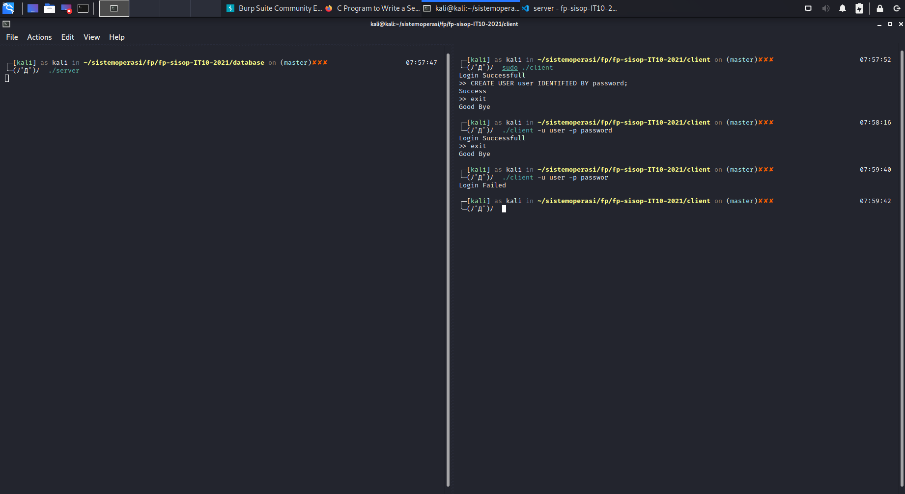

Autorisasi (Use dan Grand Permission)
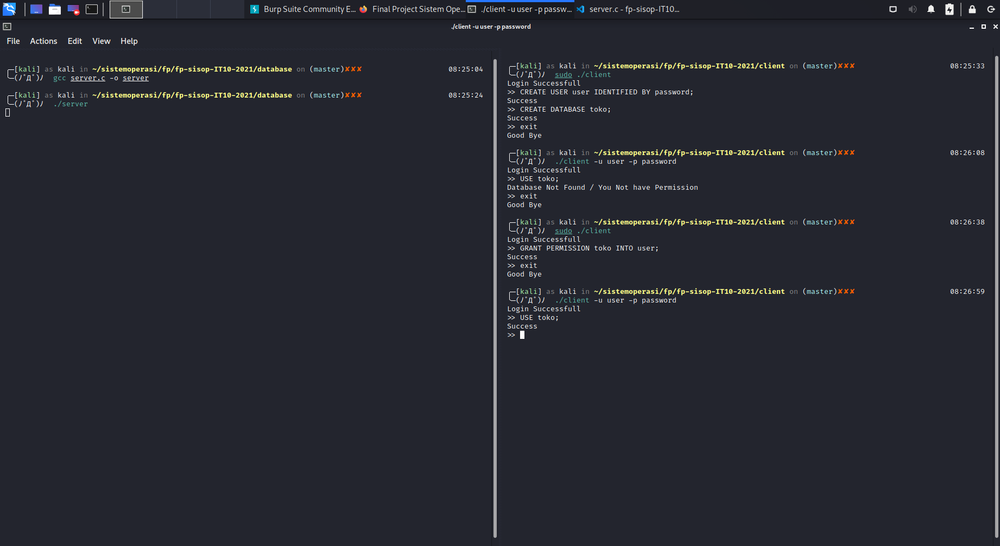

Create Table
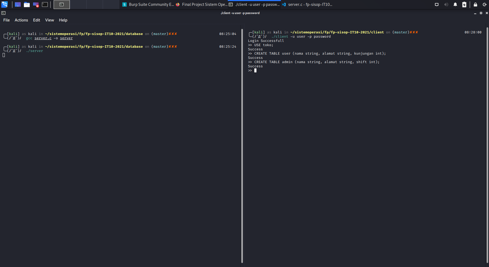

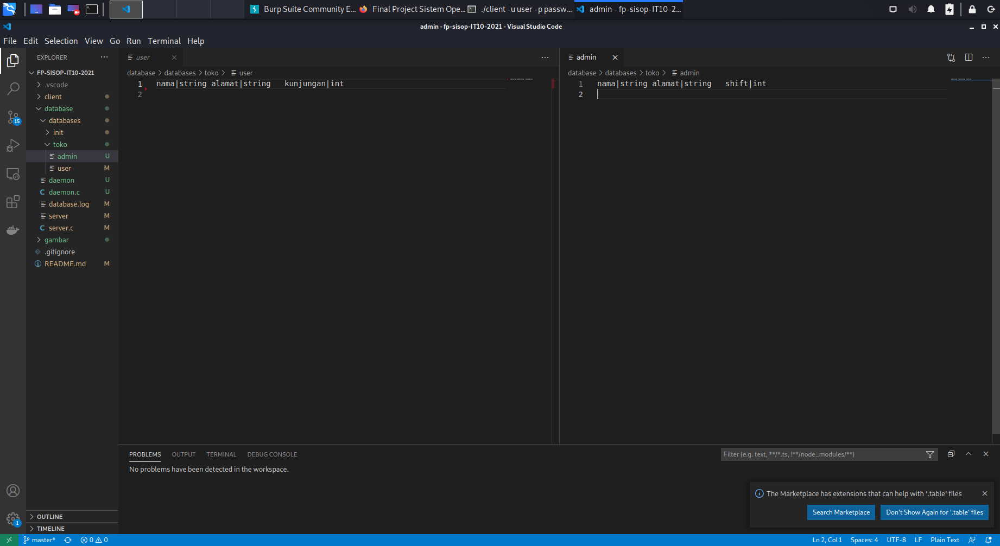


Drop Database
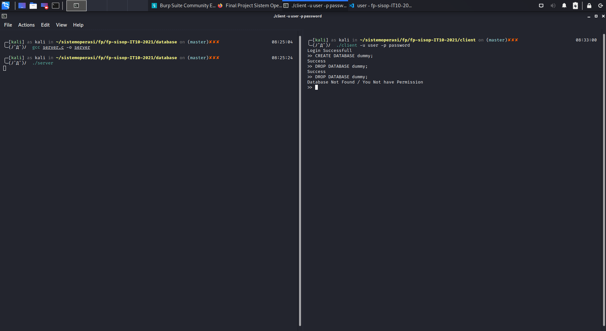

Drop Table
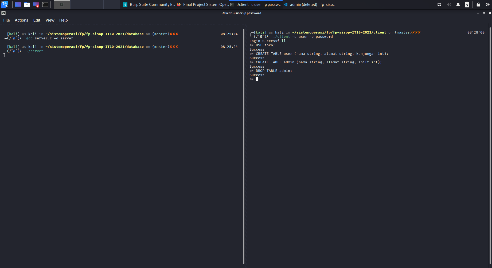


Drop Column

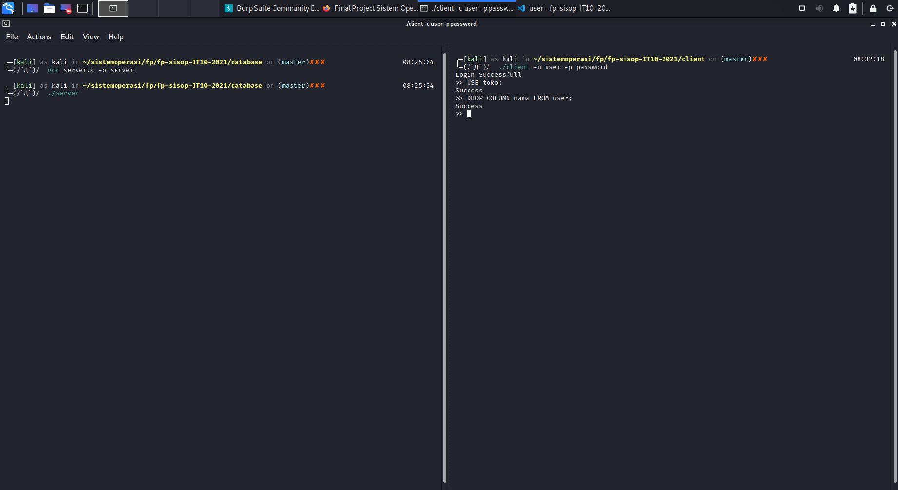

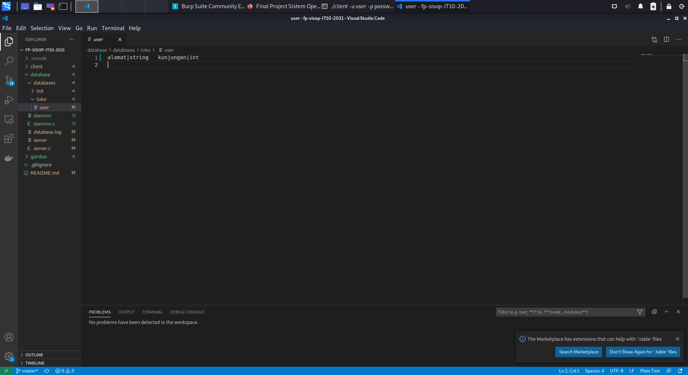

Insert

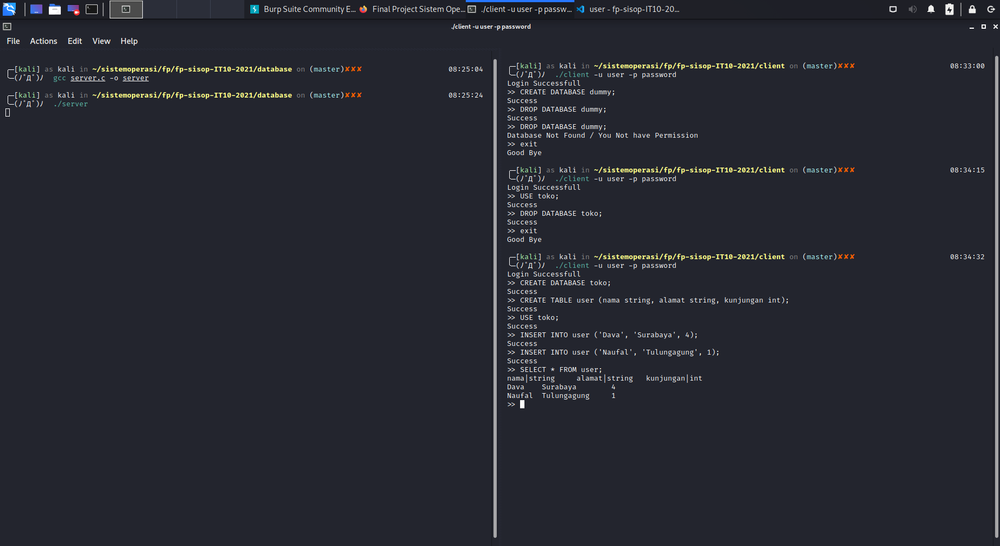

Select

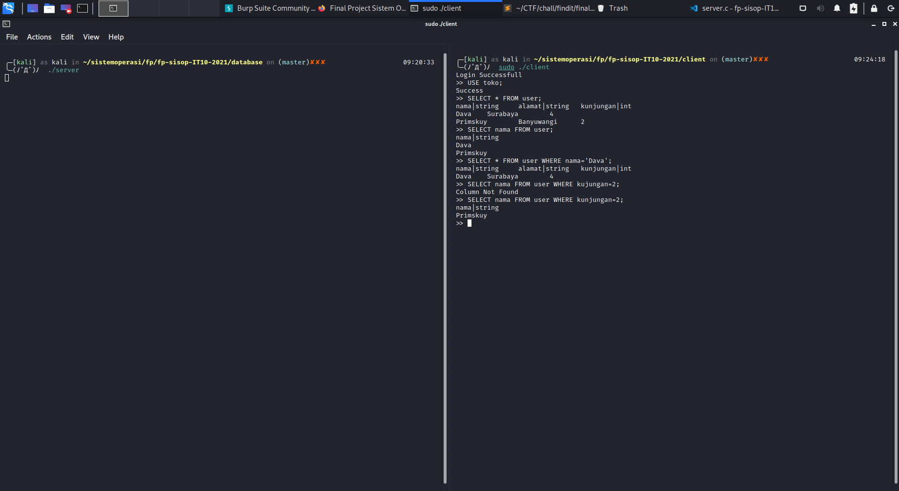

Update

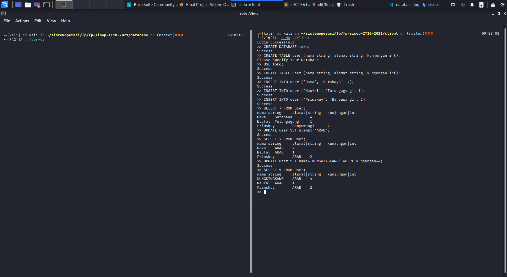

Delete

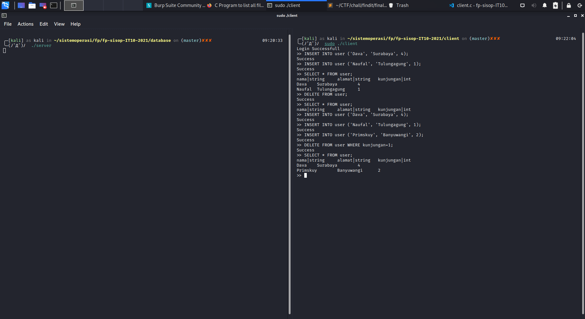

Logging

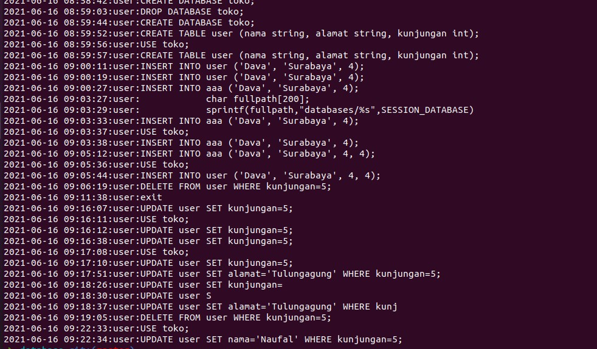
## Kendala
Kendala yang kita alami adalah tidak ada. Hanya waktu pengerjaan yang kurang saja karena laporannya juga harus selesai sama dengan kodingannya.